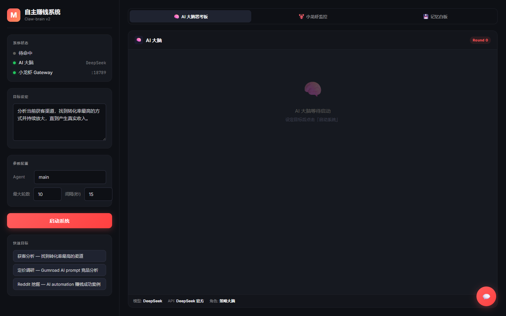

<div align="center">

# Claw-brain 🧠

**Give OpenClaw a brain that decides for itself.**

[](https://python.org)
[](LICENSE)
[](https://github.com/chu459/claw-brain)
[](https://twitter.com/Claw_brain)

</div>

> **English** | [简体中文](#中文介绍)

---

## What is Claw-brain?

OpenClaw gives AI "hands and feet" — browser automation that follows instructions. **Claw-brain gives it a "brain"** that decides what to do next on its own.

This is the missing piece between "AI can execute tasks" and "AI can figure out what tasks to execute."

It's an autonomous decision engine running a self-correcting loop:

```
Think → Decide → Act → Observe → Think again
```

### Architecture

```
┌─────────────────────────────────────────────────────────┐
│                    CLAW-BRAIN                            │
│                                                         │
│   ┌──────────┐    decision     ┌──────────────────┐     │
│   │  BRAIN   │ ────────────→   │   OPENCLAW       │     │
│   │  (LLM)   │ ←────────────   │  (Browser Agent) │     │
│   │          │    feedback     │                  │     │
│   └────┬─────┘                  └──────────────────┘     │
│        │                                                 │
│        │  writes experience      ┌──────────────────┐    │
│        └──────────────────────→  │  MEMORY          │    │
│                                  │  (Whiteboard)    │    │
│                                  └──────────────────┘    │
└─────────────────────────────────────────────────────────┘
```

### How It Works

Each cycle, the Brain:

1. **Reflect** — Review the goal, accumulated memory, and last step's feedback
2. **Decide** — Determine the next action (in natural language)
3. **Send** — Dispatch the instruction to OpenClaw for autonomous browser execution
4. **Receive** — Get execution results (success or failure)
5. **Record** — Log experience (what worked, what didn't, why)
6. **Loop** — Return to step 1 with updated context

If something fails, the Brain **analyzes why and adjusts strategy** instead of blindly retrying.

---

## Use Cases

| Goal | Description |
|------|-------------|
| **"Help me make money"** | Set a revenue target. The system researches, validates, tests, and iterates autonomously. |
| **"Get me [N] customers"** | Define target customers. It finds, researches, and tests outreach methods. |
| **"Grow my business"** | Describe your current state. It researches the market, finds bottlenecks, and does the work. |
| **"Cut costs to [target]"** | Provide expense data. It identifies waste, finds alternatives, and negotiates. |
| **"Build and ship [X]"** | Describe what you want to build. It researches, validates, and executes. |

The pattern is always the same: **you state a measurable goal, the system translates it into actions and closes the gap.**

---

## Quick Start

### Prerequisites

- [OpenClaw](https://github.com/nicepkg/openclaw) installed and running (`openclaw gateway run --force`)
- Python **3.13+**
- An LLM API key (DeepSeek, OpenAI, or any OpenAI-compatible API)

### Installation

```bash
git clone https://github.com/chu459/claw-brain.git
cd claw-brain
pip install -r requirements.txt
```

### Configuration

```bash
# Copy example config
cp .env.example .env

# Edit .env with your API key
BRAIN_API_KEY="your-api-key"
BRAIN_BASE_URL="https://api.deepseek.com/v1"
BRAIN_MODEL="deepseek-chat"
OPENCLAW_GATEWAY_URL="http://127.0.0.1:18789"
```

### Run

**Web Console (Recommended):**
```bash
python web_console.py
# Open http://127.0.0.1:7860
```

**CLI:**
```bash
python autonomous_system.py --goal "Your goal here" --loops 50
```

---

## Components

| Component | Role |
|-----------|------|
| **Brain** | LLM-driven strategy engine. Receives context, outputs structured decisions (JSON) |
| **OpenClaw Client** | Bridge to OpenClaw. Translates Brain's natural-language decisions into browser operations |
| **Memory** | Persistent whiteboard. Records successful patterns, failed attempts, and strategy evolution |
| **Web Console** | FastAPI dashboard. Real-time monitoring, human-in-the-loop chat, configurable parameters |

---

## Key Design Decisions

1. **Natural language as the interface between Brain and execution** — No fragile API coupling. The system is resilient to UI changes on target websites.
2. **Failure is data, not an error** — The Brain treats every failure as input for its next decision.
3. **Human-in-the-loop by exception** — Only interrupts you when it truly cannot proceed.
4. **Memory is the product** — Accumulated experience over time is more valuable than any single decision.

---

## Screenshots

> Screenshots will be added soon. [See Web Console Preview](#)

<!--  -->
<!--  -->

---

## Roadmap

- [x] Core autonomous loop (Think → Act → Observe → Record)
- [x] Web console with real-time monitoring
- [x] Human-in-the-loop chat interface
- [ ] Multi-agent system (Brain + BD + Content + Dev + Research agents)
- [ ] Vector memory (replace JSON with semantic search)
- [ ] Self-healing and error recovery
- [ ] Docker deployment
- [ ] Documentation site

---

## Contributing

We welcome contributions! See [CONTRIBUTING.md](CONTRIBUTING.md) for guidelines.

---

## License

**AGPL-3.0** — If you use this code (even over a network), you must share modifications under the same license. This protects the open-source ecosystem from being repackaged as a closed-source SaaS.

---

## Philosophy

> AI should serve humanity like electricity — you don't need to understand alternating current to turn on a light.

**No technical background required.** Just state your goal and become a "super-individual." No learning curve, no prompt engineering, no toolchains.

Your time should be spent **thinking**, not clicking.

The ultimate goal isn't "AI does things" — it's **restoring everyone's time and freedom**.

---

Built by [Claw-brain](https://twitter.com/Claw_brain) — 19, building AI that decides for itself.

> *"The next step for AI isn't better execution. It's autonomous decision-making."*

---

<a id="中文介绍"></a>

# Claw-brain 🧠（中文版）

**给 OpenClaw 装上能自主决策的大脑。**

## 什么是 Claw-brain？

OpenClaw 给了 AI "手和脚"—— 让 AI 能按照指令自主操作浏览器。**Claw-brain 给它装上了"大脑"**，让它自己决定下一步该做什么。

这是从"AI 能执行任务"到"AI 能自己找出该执行什么任务"的关键缺失部分。

```
思考 → 决策 → 执行 → 观察 → 再思考
```

## 使用场景

| 目标 | 描述 |
|------|------|
| **帮我赚钱** | 设定收入目标，系统自动调研、验证、测试、迭代 |
| **帮我获取 [N] 个客户** | 告诉它目标客户，自动寻找、研究、测试方法 |
| **帮我发展业务** | 提供现状，自动研究市场、找到瓶颈并执行 |
| **帮我削减成本** | 给它支出数据，识别浪费、找替代方案 |
| **帮我构建并发布 [X]** | 描述你要构建的东西，自动调研、验证、执行 |

## 快速开始

```bash
git clone https://github.com/chu459/claw-brain.git
cd claw-brain
pip install -r requirements.txt
cp .env.example .env
# 编辑 .env 填入你的 API Key

# Web 控制台（推荐）
python web_console.py
# 打开 http://127.0.0.1:7860
```

## 架构组件

| 组件 | 角色 |
|------|------|
| **大脑 (Brain)** | LLM 驱动的策略引擎，接收上下文，输出结构化决策 |
| **小龙虾 (OpenClaw)** | 浏览器自动化执行层，将自然语言指令转化为浏览器操作 |
| **记忆 (Memory)** | 持久化白板，记录成功/失败经验和策略演进 |
| **Web 控制台** | FastAPI 仪表盘，实时监控、人机对话、参数配置 |

## 核心设计决策

1. **自然语言作为大脑与执行层之间的接口** — 没有脆弱的 API 耦合，对目标网站 UI 变化具有韧性
2. **失败是数据，不是错误** — 每次失败都是下一次决策的输入
3. **按例外进行人机交互** — 只有在真正无法继续时才打断用户
4. **记忆才是真正的产品** — 随时间积累的经验比任何单次决策更有价值

## 路线图

- [x] 核心自主循环（思考→执行→观察→记录）
- [x] Web 控制台 + 实时监控
- [x] 人机对话界面
- [ ] 多 Agent 系统（大脑 + BD + 内容 + 开发 + 调研）
- [ ] 向量记忆（替代 JSON 白板）
- [ ] 自我修复和错误恢复
- [ ] Docker 一键部署
- [ ] 文档网站

## 贡献

欢迎贡献！详见 [CONTRIBUTING.md](CONTRIBUTING.md)。

## 许可证

**AGPL-3.0** — 使用此代码（即使通过网络）必须在相同许可证下共享修改。防止被包装成闭源 SaaS。

---

> 作者：[Claw-brain](https://twitter.com/Claw_brain) — 19岁，正在构建能自主决策的 AI
>
> *"AI 的下一步不是更好的执行，而是自主决策。"*
